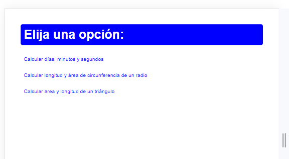
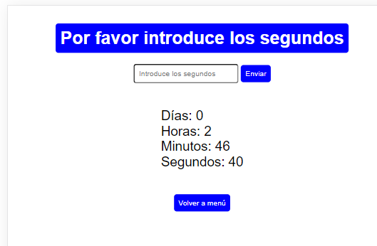
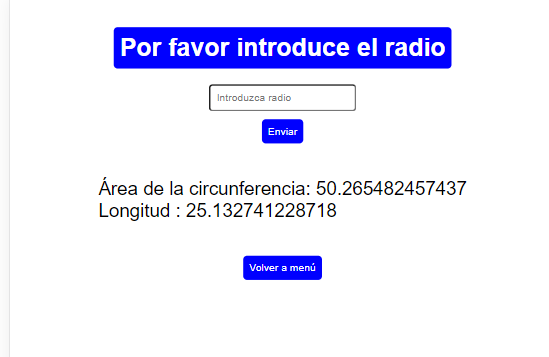
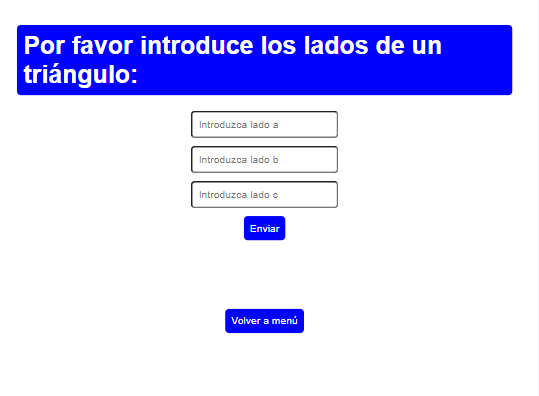
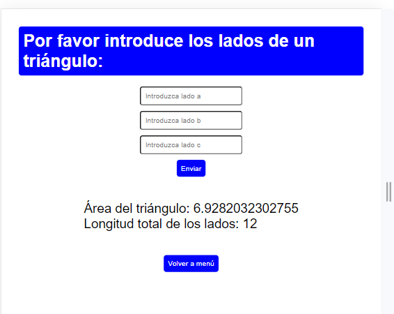

# EJERCICIO CURSO PROGRAMACIÓN WEB CON SOFTWARE LIBRE

## Tecnologías: php , Apache

## Menú principal

## Cálculo del tiempo al seleccionar la primera opción

## Cálculo de longitud y área de circunferencia a través del radio introducido en el formulario

## Cálculo de área y longitud de triángulo tras introducir los lados

